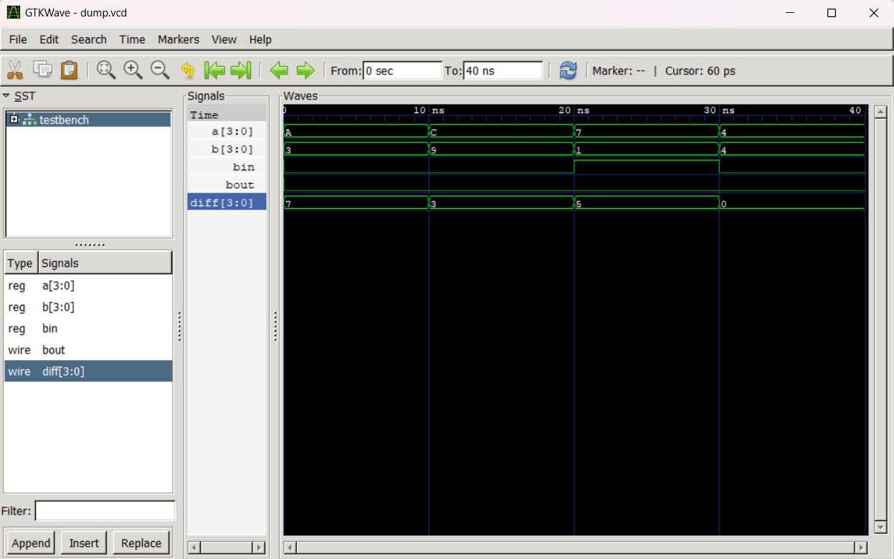

# 🔢 4-Bit Binary Subtractor in Verilog

This project implements and simulates a 4-bit binary subtractor using Verilog. The design uses **full subtractors** to perform bitwise subtraction with borrow propagation.

---

## 📁 Project Files

| File               | Description                                |
|--------------------|--------------------------------------------|
| `full_subtractor.v` | Verilog code for 1-bit full subtractor     |
| `subtractor_4bit.v` | Structural design of 4-bit subtractor       |
| `testbench.v`       | Testbench to simulate functionality         |
| `dump.vcd`          | Generated VCD file for waveform analysis    |
| `waveform.png`      | Screenshot of waveform after simulation     |

---

## ⚙️ How It Works

### ▶️ Subtraction Logic
A **full subtractor** takes in:
- `a` (minuend bit)
- `b` (subtrahend bit)
- `bin` (borrow-in)

It outputs:
- `diff` (difference bit)
- `bout` (borrow-out)

The 4-bit subtractor chains 4 such full subtractors.

---

## 📊 Logic Table (Full Subtractor)

| a | b | bin | diff | bout |
|---|---|-----|------|------|
| 0 | 0 | 0   | 0    | 0    |
| 0 | 1 | 0   | 1    | 1    |
| 1 | 0 | 0   | 1    | 0    |
| 1 | 1 | 1   | 1    | 1    |

---

## 🖥️ Simulation Output



- The waveform confirms bit-by-bit subtraction with borrow propagation.
- Test cases include combinations with and without borrow.

---

## 🛠️ How to Run

### Prerequisites:
- [Icarus Verilog](http://iverilog.icarus.com/)
- [GTKWave](http://gtkwave.sourceforge.net/)

### 💻 Steps:

```bash
iverilog -o subtractor.vvp subtractor_4bit.v testbench.v
vvp subtractor.vvp
